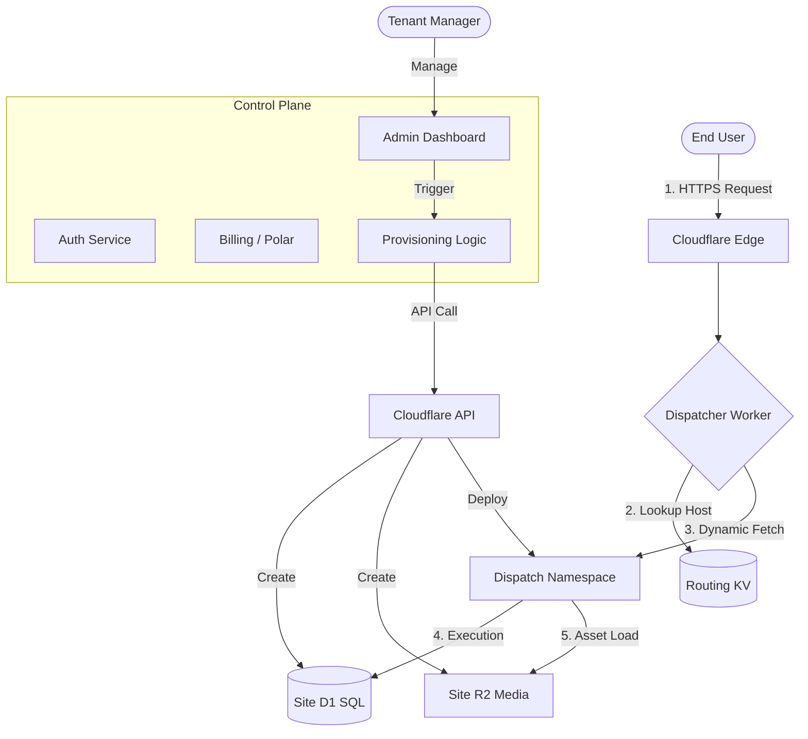

# Visual Architecture: Request Flow

This document visualizes how a request travels through the managed hosting infrastructure.

## Detailed Flow Steps

1. **Traffic Entry**: A request hits Cloudflare for `myblog.emdash.io`.
2. **Global Dispatcher**: The primary Worker (Dispatcher) intercepts the request.
3. **Routing Metadata**: The Dispatcher queries KV (Key-Value) storage to resolve the `Host` to a specific internal `script_id`.
4. **Namespace Execution**: The Dispatcher uses Workers for Platforms to call the specific script.
5. **Data Access**: The isolated script executes, connecting to its specific D1 SQL database for content and R2 bucket for images.
6. **Response**: The final HTML/Asset is returned to the user with ultra-low latency.
